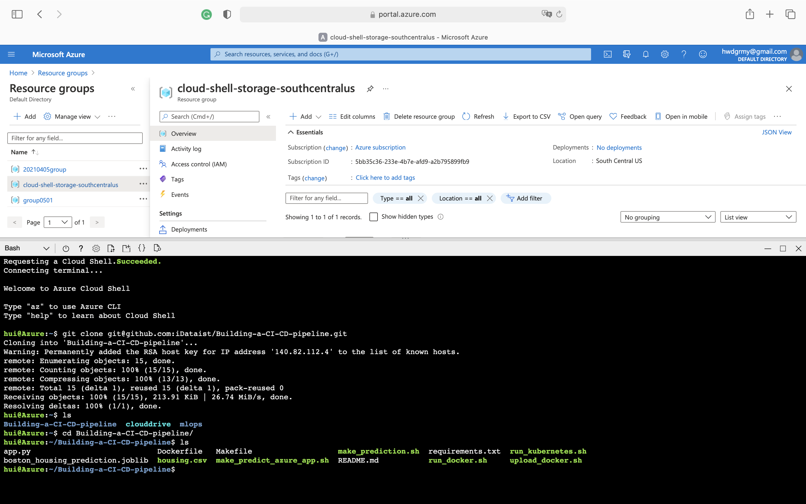
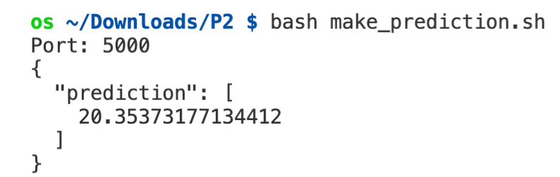

# Building a CI/CD Pipeline
[](https://github.com/iDataist/Building-a-CI-CD-pipeline/actions/workflows/main.yml)
## Overview
Establishing a Continuous Integration/Continuous Delivery (CI/CD) pipeline is critical to enable high-quality customer service experiences in today’s digital world. In this project, I built a Continuous Delivery pipeline that deploys a Flask Machine Learning application using Azure Pipelines to Azure App Services. First, I used Github Actions to perform an initial install, lint, and test cycle on a machine learning application running in Flask in Azure App Services. Second, I integrated Continuous Delivery using Azure Pipelines to deploy tested application changes automatically to production. Lastly, I tested the prediction capability of the machine learning application deployed into production. 

## Project Plan

* [Trello board](https://trello.com/invite/b/991rrsp2/557a8a37842cf3151b22957d3173efb5/kanban-template)
* [Spreadsheet]()

## Instructions


* Architectural Diagram

    

* Project cloned into Azure Cloud Shell
    
* Passing tests that are displayed after running the `make all` command from the `Makefile`
    
* Output of a test run
    
* Project running on Azure App Service
    
    
* Successful deploy of the project in Azure Pipelines.  

* Running Azure App Service from Azure Pipelines automatic deployment

* Successful prediction from deployed flask app in Azure Cloud Shell.  [Use this file as a template for the deployed prediction](https://github.com/udacity/nd082-Azure-Cloud-DevOps-Starter-Code/blob/master/C2-AgileDevelopmentwithAzure/project/starter_files/flask-sklearn/make_predict_azure_app.sh).
The output should look similar to this:

```bash
udacity@Azure:~$ ./make_predict_azure_app.sh
Port: 443
{"prediction":[20.35373177134412]}
```

* Output of streamed log files from deployed application


## Enhancements

<TODO: A short description of how to improve the project in the future>

## Demo 

<TODO: Add link Screencast on YouTube>


