# Building a CI/CD Pipeline

## Overview

Establishing a Continuous Integration/Continuous Delivery (CI/CD) pipeline is critical to enable high-quality customer service experiences in today’s digital world. In this project, I built a CI/CD pipeline that deploys a Flask Machine Learning application with GitHub Actions, Azure Pipelines and Azure App Services. First, I leveraged GitHub actions to implement continuous integration that includes install, lint and test steps. The code will always be checked automatically. Second, I used Azure pipeline for continuous delivery. Azure pipeline hooks right into Azure App Services and deployed my Flask application. Lastly, I tested the prediction capability of the machine learning application by giving it a JSON payload. 

## Project Plan

* [Trello board](https://trello.com/invite/b/991rrsp2/557a8a37842cf3151b22957d3173efb5/kanban-template)
    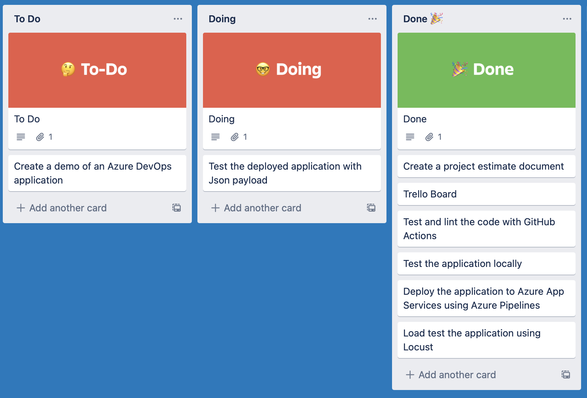
* [Time Estimate](https://github.com/iDataist/Building-a-CI-CD-pipeline/blob/main/time_estimate.xlsx)
    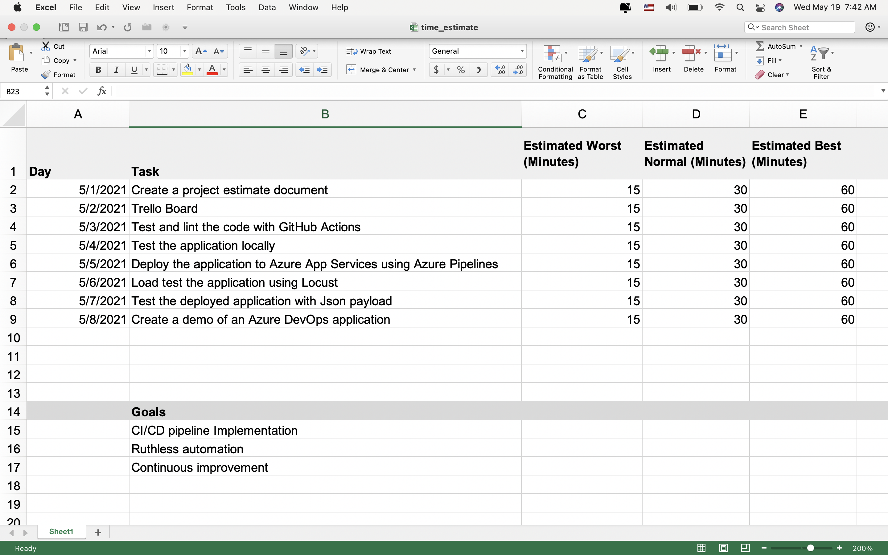

## Architectural Diagram
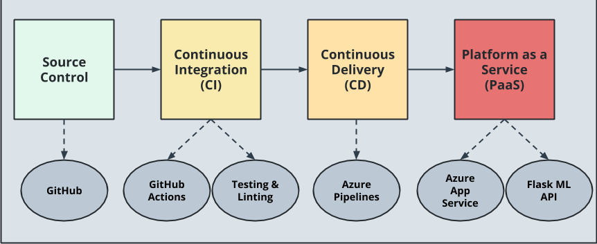

## Key Steps

1. Source Control
    * Clone the project from GitHub and open the terminal (with azure-cli installed)
        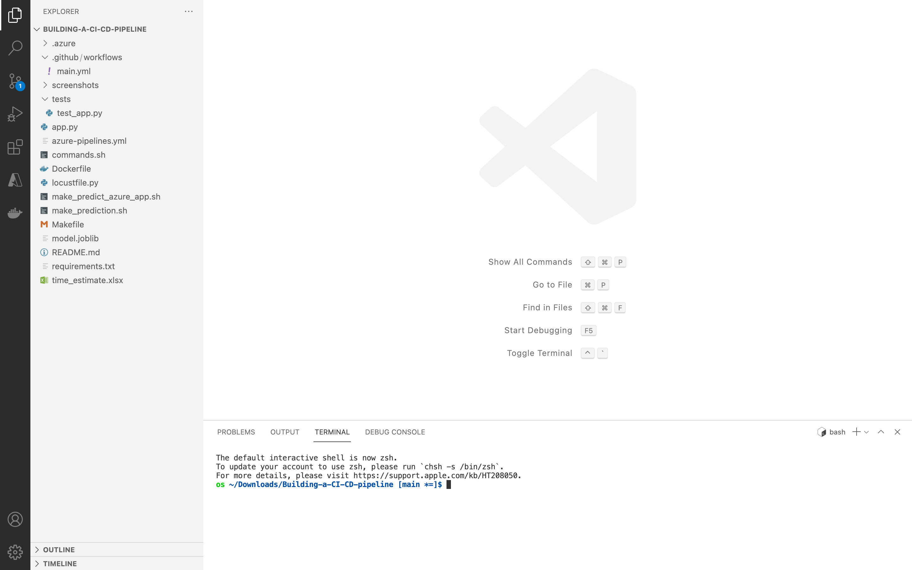
2. Continuous Integration
    * Test and lint the code locally by running the `make all` command from the `Makefile`
        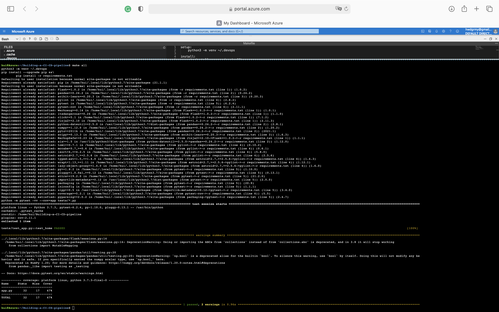
    * Test and lint the code with Github Action 
        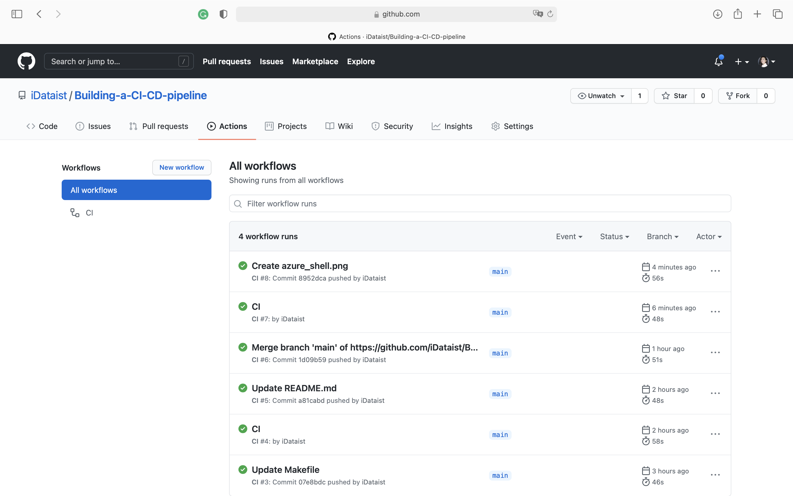
3. Continous Delivery
    * Test the app locally by running `python app.py` and generate predictions by running `bash make_prediction.sh`
    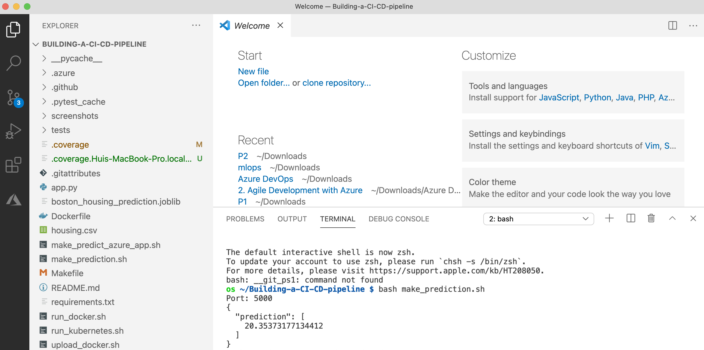
    * Deploy the machine learning app with Azure Pipelines  
        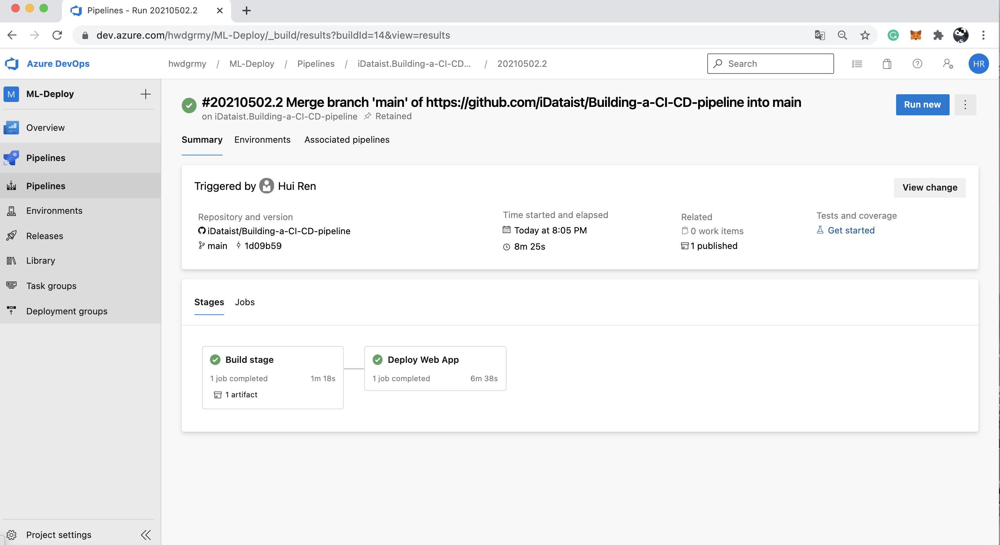
        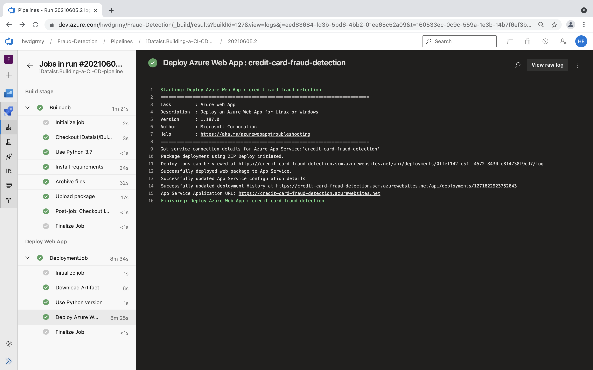
4. Platform as a Service
    * View the deployed app on Azure Portal
        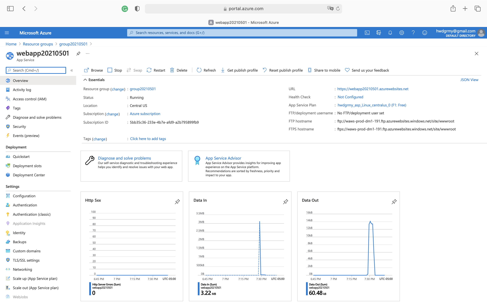
        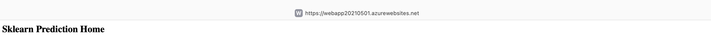
    * Load-test the web app with locust
        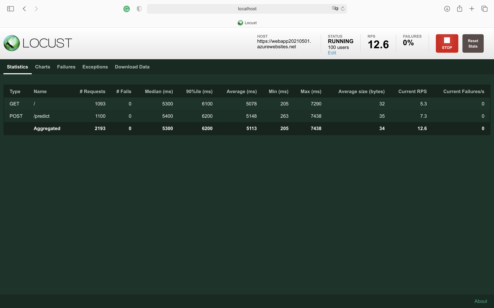
    * Generate predictions from the deployed app by running `bash make_predict_azure_app.sh` 
        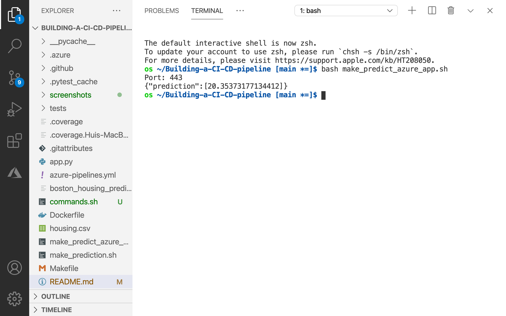
    * Review streamed log files from the deployed app
        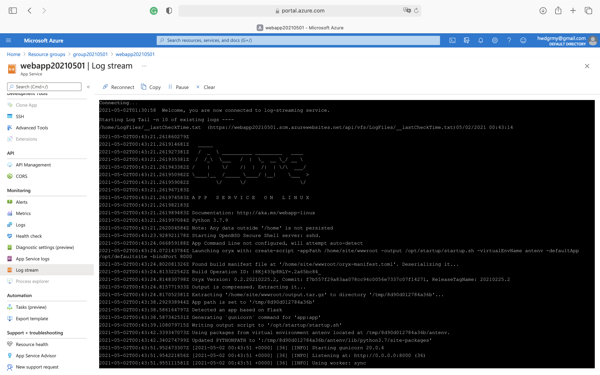

