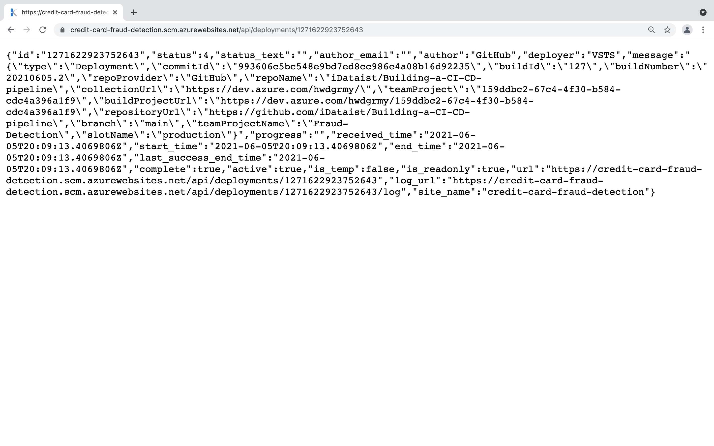

# Building a CI/CD Pipeline

## Overview
Establishing a Continuous Integration/Continuous Delivery (CI/CD) pipeline is critical to enable high-quality customer service experiences in today’s digital world. In this project, I built a Continuous Delivery pipeline that deploys a Flask Machine Learning application using Azure Pipelines to Azure App Services. First, I used Github Actions to perform an initial install, lint, and test cycle on a machine learning application running in Flask in Azure App Services. Second, I integrated Continuous Delivery using Azure Pipelines to deploy tested application changes automatically to production. Lastly, I tested the prediction capability of the machine learning application deployed into production. 

## Project Plan

* [Trello board](https://trello.com/invite/b/991rrsp2/557a8a37842cf3151b22957d3173efb5/kanban-template)
* [Spreadsheet]()

## Instructions
* Architectural Diagram
    

* Project cloned into Azure Cloud Shell
    
* Passing tests that are displayed after running the `make all` command from the `Makefile`
    
* Output of a test run
    
* Project running on Azure App Service
    
    
    
* Successful deploy of the project in Azure Pipelines  
    

* Running Azure App Service from Azure Pipelines automatic deployment
    
* Successful prediction from deployed flask app
    

* Output of streamed log files from deployed application
    
    
## Enhancements
Containerize the webapp and deploy it with AKS.
## Demo 

